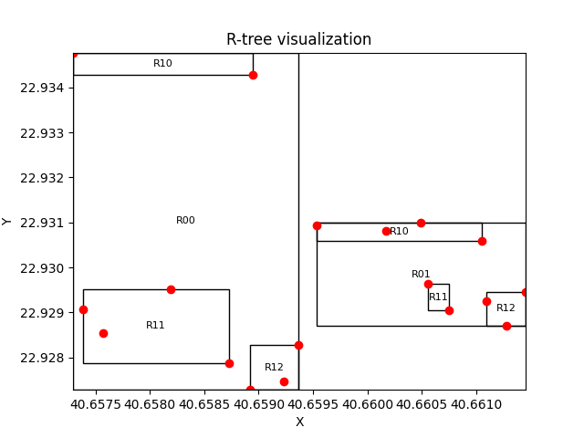

# R*-Tree-Implementation
## Overview
This project is an implementation of the R*-Tree, a variant of the R-Tree data structure used for indexing multi-dimensional information such as geographical coordinates, rectangles, and polygons.

## Features
- Efficient insertion and deletion of entries
- Optimized for spatial queries
- Supports nearest neighbor search
- Supports range queries
- Supports bulk loading through bottom-up construction
- Visualization of the R*-Tree structure

## Installation
To install and run this project, follow these steps:
1. Clone the repository:
    ```sh
    git clone https://github.com/yourusername/R-Tree-Implementation.git
    ```
2. Navigate to the project directory:
    ```sh
    cd R-Tree-Implementation
    ```
3. Install the required dependencies:
    ```sh
    pip install -r requirements.txt
    ```


   
## Usage
To use the R*-Tree implementation with an XML map from OpenStreetMap, follow these steps:

1. Download the XML map file from OpenStreetMap.
2. Place the XML file in the project directory (as map.xml).

To parse the XML file, extract the geographical data, and build the R*-Tree for efficient spatial queries
you can run the main script:
```sh
python main.py
```
If you want to have a simple visualization of how it works run the visualization script:
```sh
python visualization_funcs.py
```


## Visualization
The project includes a visualization of the R*-Tree structure. Below is an example of the visualization:



